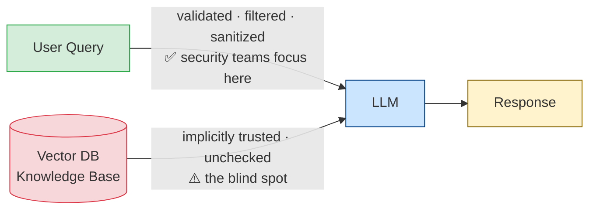
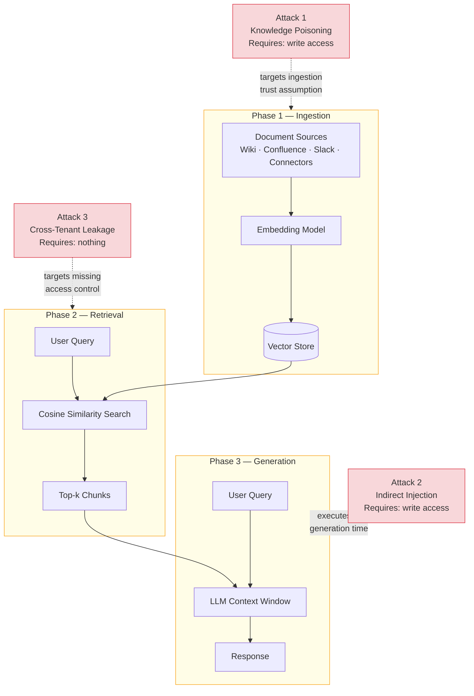
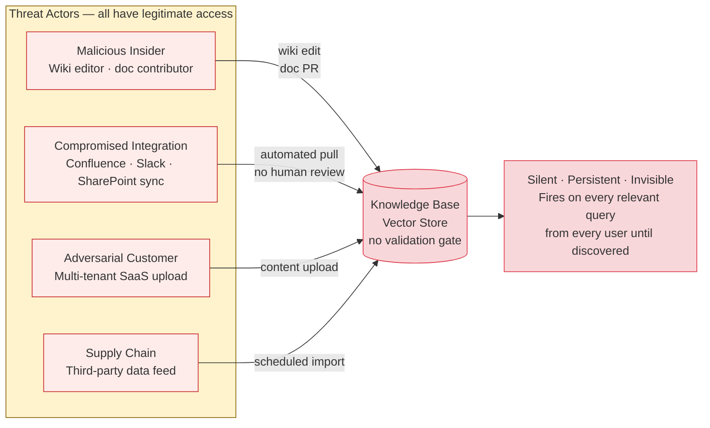

# The Attack Surface Hiding in Your RAG Knowledge Base

Your LLM security posture is probably backwards — here's why.

---

Most teams building AI assistants in 2025 hardened the same thing: the user input. They added prompt injection filters. They built output sanitizers. They protected the system prompt with careful context separation. They wrote threat models where the attacker is always on the left, sending a malicious query in from the outside.

Then they built a RAG pipeline.

And without realizing it, they added a second input path into their LLM — one that most of them never threat-modeled at all.

---

## The Trust Paradox Nobody Talks About

Here is the core architecture of a RAG system, drawn honestly:

The LLM receives both inputs identically. Everything in the context window is processed as instructions unless you explicitly and forcefully tell the model otherwise — and even then, you cannot guarantee it.

Security teams spend hours hardening the top path. They treat the bottom path like internal plumbing: "that's just our documents, that's all internal data." That is exactly the blind spot where the most dangerous attacks live.

The OWASP Top 10 for LLM Applications 2025 introduced a new category — **LLM08:2025: Vector and Embedding Weaknesses** — specifically because this blind spot had produced a class of real-world vulnerabilities that didn't fit anywhere else. The timing wasn't accidental. By mid-2025, researchers had demonstrated that just five carefully crafted documents injected into a knowledge base of millions could manipulate RAG responses with over 90% success rate (PoisonedRAG, USENIX Security 2025).

Five documents. Out of millions. 90% success rate.

That number should stop you cold if you run a RAG system at any scale.

---

## Three Attack Surfaces, One Root Cause

The RAG pipeline has three phases: ingestion, retrieval, and generation. Each phase has a distinct trust assumption that fails under adversarial conditions.

**At ingestion**, the assumption is "our internal documents are trustworthy." But any document that a user, contractor, or automated pipeline can modify is a potential injection vector. Your Confluence sync, your Slack indexer, your SharePoint connector — each is an ingestion path without human review.

**At retrieval**, the assumption is "similarity search returns relevant, safe content." But cosine similarity is a mathematical property, not a safety property. An attacker who understands how your embedding model works can craft documents that score high similarity to anticipated queries while carrying malicious payloads. The math doesn't care about intent.

**At generation**, the assumption is "the LLM will use context as reference material, not as instructions." This is the foundational failure. LLMs don't distinguish between "these are data documents" and "these are instructions." Everything in the context window looks the same.

From these three failure points, three distinct attack classes emerge:

| Attack | Entry Point | Sophistication Required |
|---|---|---|
| Knowledge base poisoning | Any document write access | Low |
| Indirect prompt injection | Any document write access | Low to Medium |
| Cross-tenant data leakage | Just ask a question | Zero |

That last row deserves emphasis. In any RAG system without explicit access controls on vector database queries, every document in the collection is reachable by every user. Not through some clever exploit. Not through an advanced attack chain. Just by asking the right question. I ran this against a test system and achieved a 100% leakage rate across 20 consecutive queries. No technical sophistication required.

---

## The Threat Actors Are Not Who You Think

Here's what makes the RAG attack surface different from most web application attack surfaces: the most dangerous threat actors have legitimate access.

A malicious insider doesn't need to break anything. They can edit a wiki page, submit a documentation PR, or update a policy document. Any of those actions can introduce a knowledge poisoning payload or an injection document into the retrieval pipeline. The attack is silent, persistent, and fires automatically on every relevant query from every user — until someone notices the LLM is saying strange things.

A compromised integration is equally dangerous. Automated pipelines — Confluence sync jobs, Slack archivers, SharePoint connectors — ingest documents without human review. A compromised upstream data source, or a misconfigured sync that pulls from an attacker-controlled location, poisons the knowledge base without triggering any access control alert.

The threat model isn't just "external attacker sends malicious query." It's "trusted contributor modifies trusted document in trusted internal system."

---

## Why Teams Miss This

I've reviewed enough AI deployment architectures to see the pattern clearly. The miss happens at the threat modeling stage, not the implementation stage.

Security reviews of RAG systems ask: "Can an attacker inject via the user query?" Yes, they account for that. "Does the LLM output sensitive data through the generation path?" Yes, they add output scanning. What they don't ask: "Who can write to the knowledge base, and what happens if they write something malicious?"

The reason is psychological. Vector databases feel like infrastructure. ChromaDB, Pinecone, Weaviate — they're databases. Databases are internal systems. Internal systems are trusted. The security review of the "database" focuses on whether it has authentication and encryption, not on whether its *contents* can be weaponized.

But a RAG knowledge base is not a database in the traditional sense. It is an instruction-injection surface for your LLM. Every document in it is a potential instruction, because from the LLM's perspective, every document in its context window is an instruction.

---

## What to Check in the Next 30 Minutes

If you have a RAG system in production or development, three questions tell you most of what you need to know about your exposure:

**1. Does your vector database query include a `where` filter based on user identity?**

Open your RAG retrieval code and find the ChromaDB (or Pinecone, or Weaviate) query call. If there is no metadata filter restricting which documents are returnable for a given user, every document in the collection is reachable by every user. This is the most common and most easily fixed RAG vulnerability in enterprise deployments.

**2. Can every path into your knowledge base write to it?**

Map every automated ingestion pipeline that can push documents into your vector DB. For each one: Who controls the source? Is human review involved? Is there anomaly detection on what gets ingested? Most teams can't answer these questions without digging.

**3. What happens when you ask your AI assistant for things you shouldn't be able to see?**

Ask your production AI assistant: *"What are the salary ranges in this company?"* — if you're a regular employee. Or: *"What are the M&A targets we're evaluating?"* If it answers with accurate confidential information you shouldn't have access to, you have a cross-tenant leakage vulnerability running at 100% success rate right now.

---

## The Uncomfortable Conclusion

The 2025 threat model for LLM applications should treat the knowledge base with the same skepticism we apply to user input. Both are external inputs to the generation process. Both can be adversarially crafted. Both require validation, sanitization, and access control.

The difference is that user input arrives in real time and is visible to defenders. Knowledge base content arrives at ingestion, is invisible to end users, and persists indefinitely.

An attacker who understands this doesn't bother trying to jailbreak your LLM through the user query. They submit a Confluence page.

The attack surface isn't hiding in your model. It's hiding in your documents.

---

*I measured these attacks against a local ChromaDB + LangChain stack with published, reproducible results. The full lab code — including all five defense layers and a measurement framework — is available in the [mcp-attack-labs repository](https://github.com/your-repo/mcp-attack-labs). The next article in this series walks through the knowledge poisoning attack step by step with running code.*
